# Reporte de Datos

Este documento contiene los resultados del análisis exploratorio de datos.

## Resumen general de los datos

Los datos cargados inicialmente cuentan con 12433 registros disponibles y 76 columnas. Tras el filtrado y la limpieza de los datos quedamos con 9563 registros y un total de 17 variables de distintas naturalezas (Categóricas múltiples, categóricas binarias, numéricas discretas y numéricas continuas).

La reducción de registros (número de observaciones) se dió principalmente tras el análisis de duplicados y el análisis de datos faltantes ([Véase para su referencia la sección de Preprocesamiento, apartados de análisis de duplicados y de datos faltantes aquí](../../scripts/preprocessing/Preprocesamiento.ipynb)).

La reducción de variables (columnas disponibles) se dió principalmente tras la definición de alcance del proyecto donde se busca predecir el precio de un vehículo en función de sus características. Esto excluye considerar la predicción del precio en función del precio en años pasados (variables del 1970 al 2017). Adicionalmente se excluyeron variables que no se consideraron significativas según la perspectiva del negocio (como "Um", "Servicio", "PesoCategoria", "Estado" y "Bcpp").

## Resumen de calidad de los datos

En esta sección se presenta un resumen de la calidad de los datos. Se describe la cantidad y porcentaje de valores faltantes, valores extremos, errores y duplicados. También se muestran las acciones tomadas para abordar estos problemas.

En el Analisis de Duplicados se evidencia que la mera revisión por el Código del vehículo (aparente llave primaria del dataset) no muestra ningún duplicado. Sin embargo, al emplear una segunda técnica concatenando Clase, Marca, Referencia1, Referencia2 y Referencia3 de los vehículos se encuentran 27 registros duplicados (por estos criterios) los cuales son desechados del dataset:
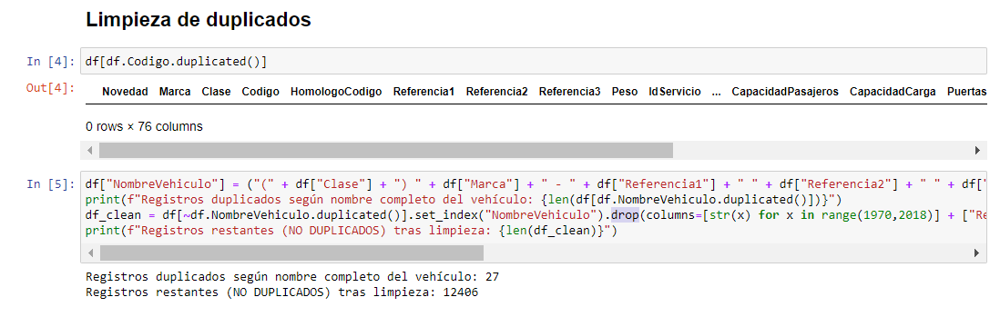

Ahora bien, como se puede observar en la primera gráfica de [Preprocesamiento](../../scripts/preprocessing/Preprocesamiento.ipynb):

Se evidencia que el dataset inicial aparentemente no tenía gran número de valores faltantes, sin embargo. Al ahondar en las características de cada campo se encontró que había enmascaramiento de valores faltantes con ceros. Por lo que se avanzó en el Analisis de datos faltantes con un reemplazamiento de ceros por Nulos en los casos en los que el Negocio indicó pertinentes:
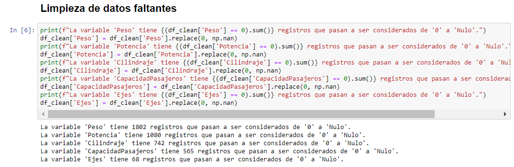

Tras esto, y la selección de las variables anteriormente seleccionadas. El nuevo Porcentaje de completitud por columna (Después de limpieza) quedó así:
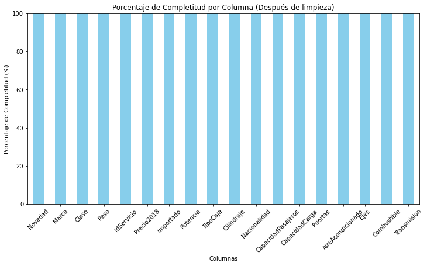

## Variable objetivo

La variable objetivo es originalmente "2018". Campo que indica el Precio de cada vehículo (En dólares) para el año 2018. La distribución de frecuencia es la siguiente:

Mediante la gráfica se puede observar una campana asimétrica negativamente con alta curtosis y cola largamente extendida.

## Variables individuales

En esta sección se presenta un análisis detallado de cada variable individual. Se muestran estadísticas descriptivas, gráficos de distribución y de relación con la variable objetivo (si aplica). Además, se describen posibles transformaciones que se pueden aplicar a la variable.

A continuación una muestra de la distribución de cada una de las variables seleccionadas por Negocio:

1. Variables Categóricas vs. Precio

* 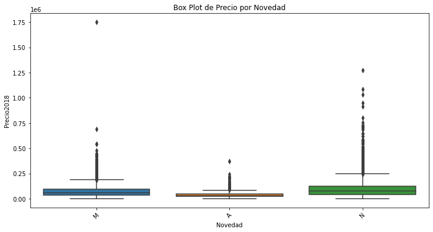 Se observa un comportamiento interesante para cada categoría, reconociendo outliers muy marcados para las categorías "M" y "N" de la variable. Se podría hacer un recorte de outliers.

* 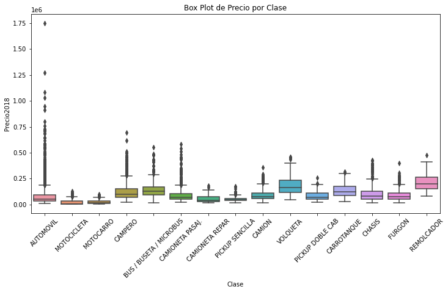 Se observan outliers marcados para "AUTOMOVIL" principalmente. Se detectan posibles relaciones en algunos grupos de Clases de vehículos. No se observa mayor necesidad de transformación.

* 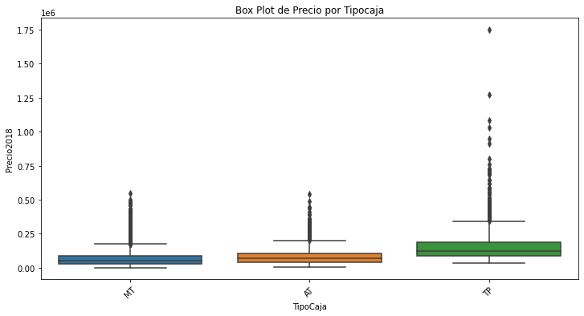 Se observa un comportamiento muy semejante entre las categorías, con la excepción de que la categoría "TP" presenta outliers que podrían ser recortados.

* 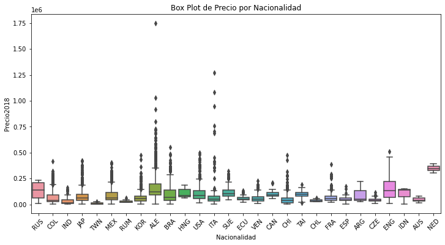 Se observan comportamientos muy interesantes respecto a la Nacionalidad de los vehículos con valores aparentemente significativos para las Nacionalidades "RUS", "ALE", "ENG" y "NED". No se intuye la necesidad de transformaciones.

* 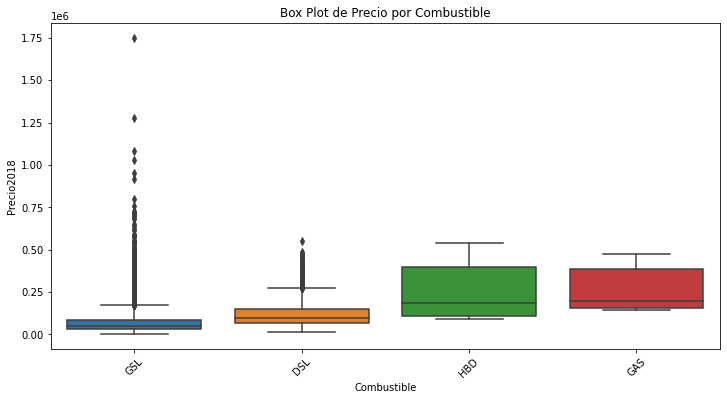 Se observa una aparente significancia de esta variable debido a la presencia de altos rangos intercuartílicos para "HBD" y "GAS" por un lado y, por otro lado, un IQR menor para "GSL" y "DSL" pero con presencia de distribuciones aparentemente más planas. No se intuyen transformaciones.

* 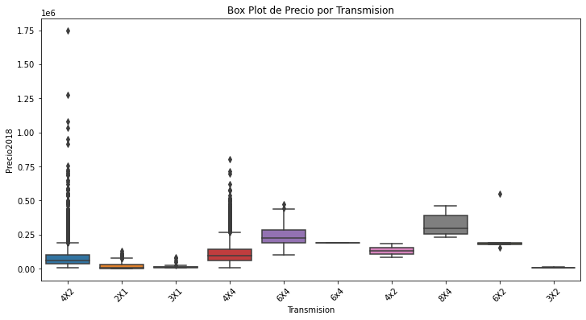 Se observan comportamientos aparentemente significativos para algunas categorías que empujan precios evidentemente más altos (como 8x4) pero otras con aparente mayor presencia (4x2, 4x4) y quizá algunos outliers (4x2, 6x2). Se podrían recordar outliers.

* 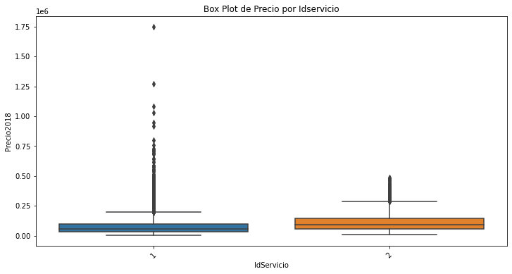 En esta variable binaria se observa una posible relación entre el precio y si el vehículo es de servicio Público o Privado. Siendo 1 el servicio Público se observa una mayor distribución en la frecuencia de los precios, pero con medidas de asociación algo menores al 2. No se piensa transformar.

* 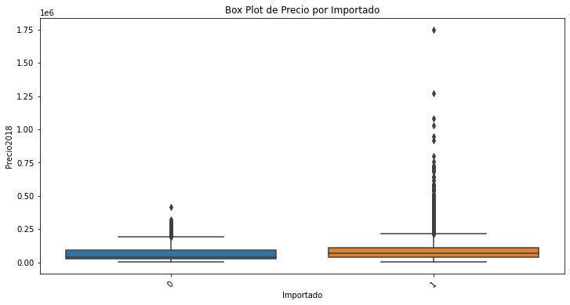 Acá se puede empezar a confirmar una de las intuiciones del negocio acerca de que los autos importados son significativamente más costosos. Pareciera que hay una tendencia, sin embargo las pruebas posteriores rechazarán o no dicha hipótesis.

*  Igual que en la variable anterior pareciera encontrarse aquí una tendencia a que los autos con aire acondicionado sean significativamente más costosos. Sin embargo eso puede estar explicado también por otros factores como la Clase de vehículo, Capacidad de pasajeros, entre otros. No se recomienda trasnformar.

2. Variables numéricas discretas vs. Precio

* 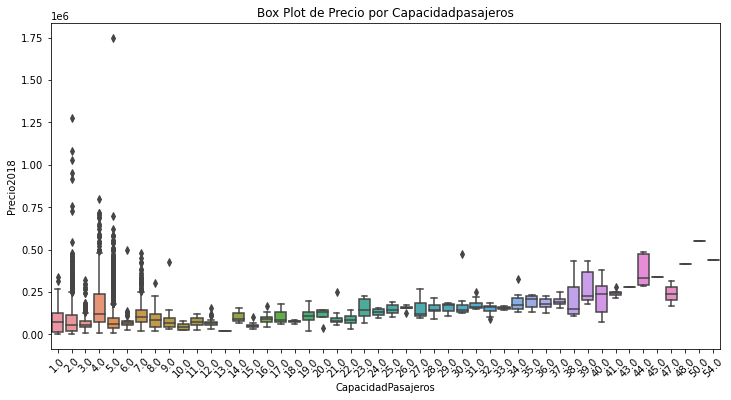 El diagrama de caja en este caso no resultó ser muy acertado debido a la alta cantidad de valores en la distribución de la variable. No obstante se puede percibir un comportamiento de "a más Capacidad de pasajeros, más alto tiende a ser el precio" con ciertas excepciones en los valores inferiores.

* 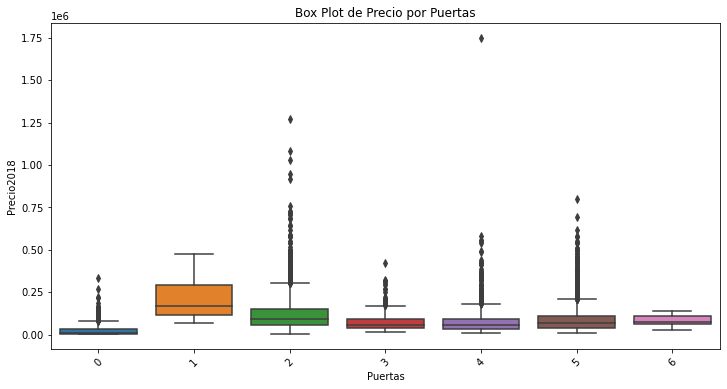 Esta variable resulta aparentemente poco significativa para responder al precio del vehículo hasta el momento. No se recomiendan transformaciones.

* 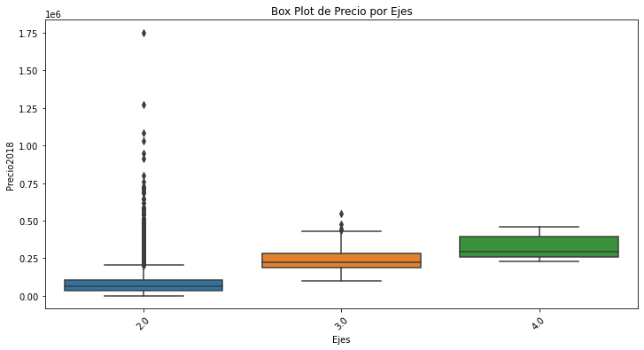 Los ejes de un vehículo encapsulan varios Tipos de vehículos, esta variable resulta muy interesante ya que se ve evidente que a más ejes mayor el precio. Es natural que con 2 ejes encontremos tal dispersión ya que ahí se comprenden muchisimos tipos de vehículos entre los cuales las otras variables (Puertas, peso, capacida de pasajeros, etc) ayudará a desglosar mejor. No se recomienda transformar.

3. Variables numéricas continuas vs. Precio

* 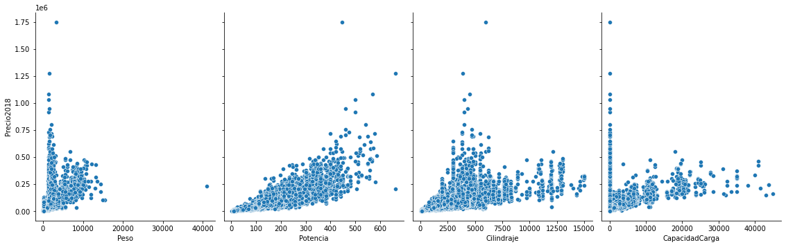 En esta gráfica podemos observar cómo todas las variables continuas (sin estandarización) presentan una aparente correlación positiva con el precio de los vehículos. No se recomienda trasnformar ninguna.

## Relación entre variables explicativas y variable objetivo

Adicionalmente a las relaciones expresadas en el apartado anterior, a continuación se presenta un analisis más exhaustivo de las 17 variables disponibles vs. nuestra variable endógena (Precio):

1. **Análisis de Varianza (ANOVA) para las variables categóricas**: Recordemos que en esta prueba es importante validar el estadístico *p-value* para poder determinar si hay significancia estadística solamente basándonos en la varianza de cada variable exógena por separado en relación a la variable endógena.
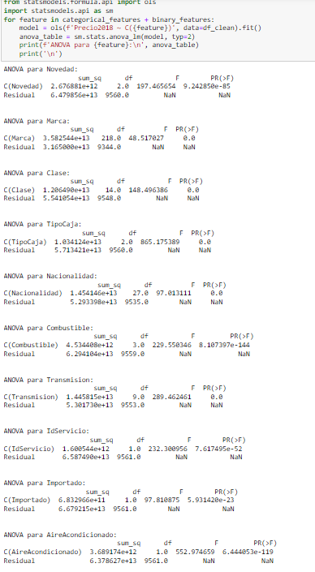

Se puede observar que TODAS las variables evaluadas (solamente las categóricas) cumplen con que el valor de sus respectivos *p-value* NO son mayores a 0.05 (5% de significancia o 95% de confianza) por lo que se rechaza la hipotesis de que no sean variables significativas en relación a la endógena (Precio del vehículo).

2. **Análisis de correlación de Pearson para las variables numéricas**: Recordemos que esta relación busca evaluar si cada variable exógena afecta (positiva o negativamente) a la variable endógena o si, por el contrario, pareciera resultarle indiferente.
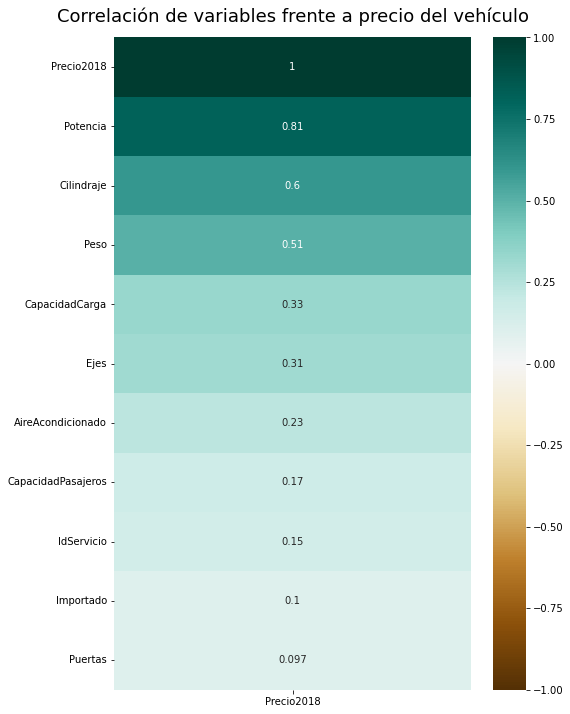

Se puede observar que todas las variables evaluadas (solamente las numéricas) resultan con correlaciones positivas (mayores a 0) indicando que en tanto afecten al precio de los vehículos, lo hacen de manera positiva (si la exógena aumenta, la endógena también tenderá a aumentar). Adicionalmente se perciben fuertes correlaciones con las variables *Potencia*, *Cilindraje* y *Peso*. Se notan correlaciones más débiles con las variables *Puertas* y *Importado*, las cuales no se descartarán sino hasta ejecutar el entrenamiento de un modelo y analizar la importancia de estas características dentro del modelo completo (no por separado).
