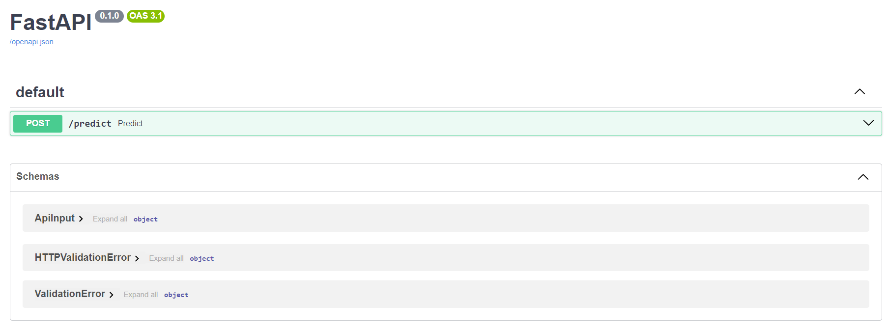
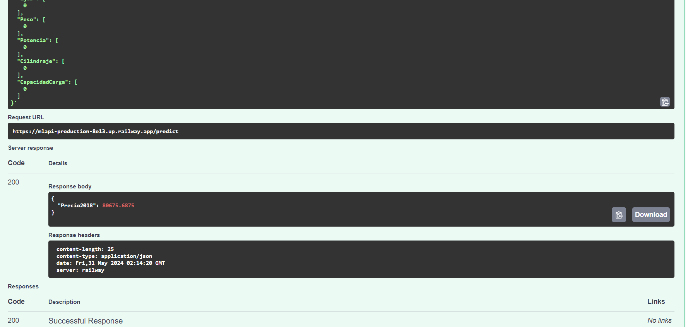

# Despliegue de modelos

## Infraestructura

- **Nombre del modelo:** Modelo de Predicción de Precios de Vehículos
- **Plataforma de despliegue:** FastAPI
- **Requisitos técnicos:**
    - Python 3.7+
    - Bibliotecas de terceros:
        - FastAPI
        - Pydantic
        - Pickle
        - XGBoost
        - NumPy
    - Hardware: Servidor con suficiente RAM y capacidad de procesamiento para manejar las solicitudes del modelo.
- **Requisitos de seguridad:** 
    - Autenticación: No se ha implementado la autenticación en este ejemplo, se recomienda implementarla en un entorno de producción.
    - Encriptación de datos: Se recomienda implementar la encriptación de datos para la transmisión de información sensible.

## Código de despliegue

- **Archivo principal:** `main.py`
- **Rutas de acceso a los archivos:**
    - `xgb_regressor.pkl`: Archivo que contiene el modelo XGBoost.
- **Variables de entorno:**
    - No se utilizan variables de entorno en este ejemplo.

## Documentación del despliegue

**Instrucciones de instalación:**

1. Instalar Python 3.7+ en su servidor.
2. Instalar las bibliotecas de terceros utilizando pip:
    ```bash
    pip install fastapi pydantic pickle xgboost numpy
    ```
3. Descargar el archivo `main.py` y el archivo `xgb_regressor.pkl` en el servidor.

**Instrucciones de configuración:**

1. Asegurar que el archivo `xgb_regressor.pkl` se encuentra en la misma carpeta que `main.py`.
2. No se requiere configuración adicional en este ejemplo.

**Instrucciones de uso (Python):**

1. Ejecutar el servidor FastAPI con el comando:
    ```bash
    uvicorn main:app --reload
    ```
2. Enviar un request `POST` a la URL `http://localhost:8000/predict` con los datos de entrada en formato JSON.
3. La respuesta del API será un objeto JSON con la predicción del precio.

**Instrucciones de uso (FastAPI SWAGGER):**

1. Entrar a la URL: https://mlapi-production-8e13.up.railway.app/docs
2. Desplegar el endpoint **/predict**

3. Click en botón "Try it out".
4. Modificar el Request Body bajo preferencias.
5. Click en botón "Execute".
6. Bajar hasta ver el resultado predicho:


**Instrucciones de mantenimiento:**

1. Actualizar el modelo XGBoost con nuevos datos y guardar el nuevo modelo en el archivo `xgb_regressor.pkl`.
2. Reiniciar el servidor FastAPI para cargar el nuevo modelo.