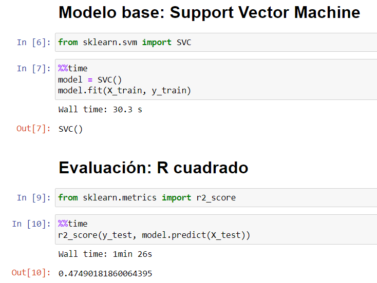
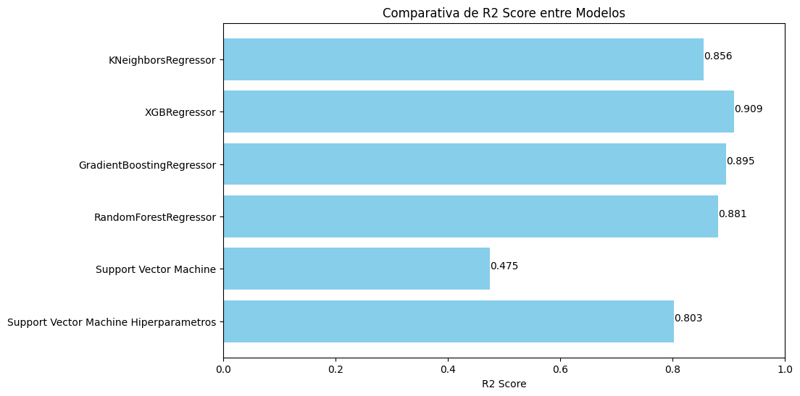

# Reporte del Modelo Baseline

Este documento contiene los resultados del modelo baseline.

## Descripción del modelo

El modelo base seleccionado es el Support Vector Machine (SVM), el cual es altamente recomendado para problemas de regresión, especialmente cuando se enfrenta a datos atípicos y alta dimensionalidad. Dado que nuestro conjunto de datos contiene 285 características y 9563 muestras, SVM es una elección adecuada. Sin embargo, es importante tener en cuenta que SVM es sensible a las diferencias en las escalas de los datos, por lo que todas las variables fueron escaladas adecuadamente durante el preprocesamiento.

Otros modelos analizados son:

* RandomForestRegressor
* GradientBoostingRegressor
* XGBRegressor
* KNeighborsRegressor
* SVM con análisis de hiperpárametros

## Variables de entrada

Las variables de entrada o características (Features) del modelo son:

* 'Novedad_M' 'Novedad_N'
* 'Marca_ACURA' 'Marca_AG' 'Marca_AGRALE' 'Marca_AKT' 'Marca_ALEKO' 'Marca_ALFA ROMEO' 'Marca_AMC' 'Marca_AMPLE' 'Marca_APRILIA' 'Marca_ARCTIC CAT' 'Marca_AROCARPATI' 'Marca_ASIA' 'Marca_ATM' 'Marca_AUDI' 'Marca_AUPACO' 'Marca_AUTECO' 'Marca_AYCO' 'Marca_BAIC' 'Marca_BAW' 'Marca_BENELLI' 'Marca_BMW' 'Marca_BORGO' 'Marca_BRILLIANCE' 'Marca_BRP CAN AM' 'Marca_BUICK' 'Marca_BYD' 'Marca_CADILLAC' 'Marca_CAGIVA' 'Marca_CHANA' 'Marca_CHANGAN' 'Marca_CHANGFENG' 'Marca_CHANGHE' 'Marca_CHERY' 'Marca_CHEVROLET' 'Marca_CHRYSLER' 'Marca_CITROEN' 'Marca_CMC' 'Marca_DACIA' 'Marca_DADI' 'Marca_DAEWOO' 'Marca_DAF' 'Marca_DAIHATSU' 'Marca_DAYANG' 'Marca_DERBI' 'Marca_DFAC' 'Marca_DFSK/DFM/DFZL' 'Marca_DINA' 'Marca_DODGE' 'Marca_DONGBEN' 'Marca_DS' 'Marca_DUCATI' 'Marca_EAGLE CARGO' 'Marca_EUROPAMOTOS' 'Marca_EUROSTAR D`LONG' 'Marca_FAW AMI' 'Marca_FERRARI' 'Marca_FIAT' 'Marca_FIRENZE' 'Marca_FORD' 'Marca_FOTON' 'Marca_FREIGHTLINER' 'Marca_FUSO' 'Marca_GEELY' 'Marca_GLOW' 'Marca_GMC' 'Marca_GOLDEN DRAGON' 'Marca_GOMOTOR' 'Marca_GONOW' 'Marca_GREAT WALL MOTOR' 'Marca_GUZI' 'Marca_HAFEI' 'Marca_HAIMA' 'Marca_HAOJIANG' 'Marca_HAOJUE' 'Marca_HARLEY DAVIDSON' 'Marca_HERO' 'Marca_HIGER' 'Marca_HINO' 'Marca_HONDA' 'Marca_HONLEI' 'Marca_HUALIN' 'Marca_HUANGHAI' 'Marca_HUMMER' 'Marca_HUSQVARNA' 'Marca_HYOSUNG' 'Marca_HYUNDAI' 'Marca_INFINITI' 'Marca_INTERNATIONAL' 'Marca_ISUZU' 'Marca_IVECO' 'Marca_JAC' 'Marca_JAGUAR' 'Marca_JAWA' 'Marca_JEEP' 'Marca_JIALING' 'Marca_JINBEI' 'Marca_JINCHENG' 'Marca_JINFENG' 'Marca_JMC' 'Marca_JOYLONG' 'Marca_KAMAZ' 'Marca_KAWASAKI' 'Marca_KAYAK' 'Marca_KAZUKI' 'Marca_KEEWAY' 'Marca_KENWORTH' 'Marca_KIA' 'Marca_KTM' 'Marca_KYMCO' 'Marca_KYOTO' 'Marca_LADA' 'Marca_LANCIA' 'Marca_LAND ROVER' 'Marca_LANDWIND' 'Marca_LEXUS' 'Marca_LIFAN' 'Marca_LINCOLN' 'Marca_LML' 'Marca_LMX' 'Marca_MACK' 'Marca_MAHINDRA' 'Marca_MASERATI' 'Marca_MAXMOTOR' 'Marca_MAXUS' 'Marca_MAZDA' 'Marca_MD BIKES' 'Marca_MERCEDES BENZ' 'Marca_MERCURY' 'Marca_MG' 'Marca_MINI' 'Marca_MITSUBISHI' 'Marca_MORINI' 'Marca_MOTO ABC' 'Marca_MOTO GUZZI' 'Marca_MTK' 'Marca_MUDAN' 'Marca_MV AGUSTA' 'Marca_NISSAN' 'Marca_NITRO' 'Marca_NON PLUS ULTRA' 'Marca_OLTCIT' 'Marca_OPEL' 'Marca_PASSAGGIO' 'Marca_PEGASO' 'Marca_PEUGEOT' 'Marca_PIAGGIO' 'Marca_POLARIS' 'Marca_PONTIAC' 'Marca_PORSCHE' 'Marca_QINGQI' 'Marca_RENAULT' 'Marca_ROVER' 'Marca_ROYAL ENFIELD' 'Marca_SAAB' 'Marca_SACHS' 'Marca_SAICWULING' 'Marca_SANYA' 'Marca_SATURN' 'Marca_SCANIA' 'Marca_SCION' 'Marca_SCOMADI' 'Marca_SEAT' 'Marca_SHINERAY' 'Marca_SHUANGHUAN' 'Marca_SIGMA' 'Marca_SINOTRUK' 'Marca_SKODA' 'Marca_SKYGO' 'Marca_SMART' 'Marca_SMC' 'Marca_SOYAT' 'Marca_SSANGYONG' 'Marca_STEYR' 'Marca_SUBARU' 'Marca_SUKIDA' 'Marca_SUKYAMA' 'Marca_SUZUKI' 'Marca_SYM' 'Marca_T-KING' 'Marca_TATA' 'Marca_TEMPEST' 'Marca_TIANMA' 'Marca_TITANIA' 'Marca_TMD' 'Marca_TONGKO' 'Marca_TOYOTA' 'Marca_TRIUMPH' 'Marca_TVS' 'Marca_TX MOTORS' 'Marca_UFO' 'Marca_UKM' 'Marca_UNITED MOTORS' 'Marca_USW MOTORS' 'Marca_VERUCCI' 'Marca_VESPA' 'Marca_VICTORY' 'Marca_VOLKSWAGEN' 'Marca_VOLVO' 'Marca_WANXIN' 'Marca_WCR' 'Marca_XIANFENG' 'Marca_XINGYUE' 'Marca_XINKAI' 'Marca_YAKEY' 'Marca_YAKIMA' 'Marca_YAMAHA' 'Marca_YAXING' 'Marca_YINGANG' 'Marca_YUEJIN-NAVECO' 'Marca_YUGO' 'Marca_YUTONG' 'Marca_ZAHAV' 'Marca_ZHONGNENG' 'Marca_ZHONGXING' 'Marca_ZNA' 'Marca_ZONGSHEN' 'Marca_ZOTYE' 'Marca_ZQ MOTORS'
* 'Clase_BUS / BUSETA / MICROBUS' 'Clase_CAMION' 'Clase_CAMIONETA PASAJ.' 'Clase_CAMIONETA REPAR' 'Clase_CAMPERO' 'Clase_CARROTANQUE' 'Clase_CHASIS' 'Clase_FURGON' 'Clase_MOTOCARRO' 'Clase_MOTOCICLETA' Clase_PICKUP DOBLE CAB' 'Clase_PICKUP SENCILLA' 'Clase_REMOLCADOR' 'Clase_VOLQUETA'
* 'TipoCaja_MT' 'TipoCaja_TP'
* 'Nacionalidad_ARG' 'Nacionalidad_AUS' 'Nacionalidad_BRA' 'Nacionalidad_CAN' 'Nacionalidad_CHI' 'Nacionalidad_CHL' 'Nacionalidad_COL' 'Nacionalidad_CZE' 'Nacionalidad_ECU' 'Nacionalidad_ENG' 'Nacionalidad_ESP' 'Nacionalidad_FRA' 'Nacionalidad_HNG' 'Nacionalidad_IDN' 'Nacionalidad_IND' 'Nacionalidad_ITA' 'Nacionalidad_JAP' 'Nacionalidad_KOR' 'Nacionalidad_MEX' 'Nacionalidad_NED' 'Nacionalidad_RUM' 'Nacionalidad_RUS' 'Nacionalidad_SUE' 'Nacionalidad_TAI' 'Nacionalidad_TWN' 'Nacionalidad_USA' 'Nacionalidad_VEN'
* 'Combustible_GAS' 'Combustible_GSL' 'Combustible_HBD'
* 'Transmision_3X1' 'Transmision_3X2' 'Transmision_4X2' 'Transmision_4X4' 'Transmision_4x2' 'Transmision_6X2' 'Transmision_6X4' 'Transmision_6x4' 'Transmision_8X4'
* 'IdServicio'
* 'Importado'
* 'AireAcondicionado'
* 'CapacidadPasajeros'
* 'Puertas'
* 'Ejes'
* 'Peso'
* 'Potencia'
* 'Cilindraje'
* 'CapacidadCarga'

## Variable objetivo

La variable endógena que se busca estimar es: **Precio2018**

## Evaluación del modelo

### Métricas de evaluación

Descripción de las métricas utilizadas para evaluar el rendimiento del modelo: Se utilizará el coeficiente de determinación *R^2* como métrica principal para evaluar el rendimiento del modelo baseline.

### Resultados de evaluación

Tras realizar el entrenamiento del modelo y su respectiva evaluación obtuvimos un coeficiente de determinación *R^2* de 47.49% para este modelo base sin análisis ni optimización de hiperpárametros:

## Análisis de los resultados

Tras realizar el entrenamiento de este modelo base se obtiene un umbral que esperamos superar con futuras configuraciones y experimentos enfocados en las diversas opciones que tenemos de modificar la etapa de modelado para mejorar el rendimiento y la capacidad de predecir de nuestro modelo.

Un coeficiente de determinación *R^2* de casi 48% no está mal para empezar, sin embargo entre más logremos aumentar esta métrica mejor será el modelo que permitirá al negocio realizar las predicciones de precios de vehículos en Colombia.

## Otros Modelos

* RandomForestRegressor: Este modelo muestra un rendimiento significativamente mejor que el modelo baseline, con un coeficiente de determinación (R2) de 0.881. Esto indica que el RandomForestRegressor explica aproximadamente el 88.1% de la variabilidad en los datos.
* GradientBoostingRegressor: Con un coeficiente de determinación (R2) de 0.895, el GradientBoostingRegressor supera al modelo baseline, demostrando una mejora en la capacidad de explicar la variabilidad en los datos.
* XGBRegressor: Con el coeficiente de determinación (R2) más alto de 0.909, el XGBRegressor es el mejor modelo en términos de explicar la variabilidad en los datos.
* KNeighborsRegressor: Este modelo también supera al modelo baseline con un coeficiente de determinación (R2) de 0.856, lo que indica una mejora significativa en la capacidad de predecir la variable objetivo en comparación con el modelo baseline.

* Fortalezas:
RandomForestRegressor, GradientBoostingRegressor y XGBRegressor tienen un rendimiento notablemente alto en términos de R2.
KNeighborsRegressor muestra un rendimiento sólido.

* Debilidades:
El modelo baseline tiene un rendimiento inferior en comparación con los otros modelos en términos de R2, lo que nos indica la importancia del análisis de los hiperparámetros.

## Conclusiones

Tras los resultados obtenidos se percibe un avance en la capacidad de predicción del precio de los vehículos en Colombia para el año 2018. Frente a la necesidad del negocio estamos obteniendo un 48% de ajuste del modelo frente a las estimaciones de precios, lo cual es positivo debida la complejidad del proyecto y refleja igualmente una buena selección de características iniciales en el proyecto.

Los modelos RandomForestRegressor, GradientBoostingRegressor, XGBRegressor y KNeighborsRegressor han demostrado una mejora significativa en la capacidad de explicar y predecir la variable objetivo en comparación con el modelo baseline. Se recomienda explorar más estos modelos y realizar ajustes de hiperparámetros para mejorar aún más su precisión.
